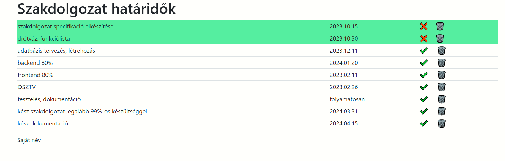

# 01 TODO alapfeladat
Készíts egy osztályt TodoView néven, amely megjeleníti az adatokat egy táblázatban!
Az adatok külön fájlban, egy listában  vannak, a listaelemek objektumok. 
A main.js a program belépési pontja, ide importáld a listát és az osztályt is itt példányosítsd!
Ha jól megy, akkor módosítsd az osztályt úgy, hogy a listában lévő objektumok minden kulcsához tartozó értékeket is meg tudd jeleníteni!
Minden sor mellett legyen egy szerkesztés és egy törlés gomb. 
A szerkesztés gombbal készre jelenthetjük az adott feladatot, a törlés gombbal pedig törölhetjük az adott sort a listából. 

Mivel a listaelemeket szerkeszteni is kell, ezért hozz létre még egy osztályt TodoElemView néven. Ez fogja jelenteni a táblázat egyetlen sorát!
Ekkor már könnyen tudsz hivatkozni minden sorban a saját szerkesztés és törlés gombra. 

A gombokra tegyél eseménykezelőket! 
Hozz létre saját eseményt, mely akkor váltódik ki, amikor rákattintasz a gombra!
A saját eseményre iratkozz fel a főporgramban (main)!

